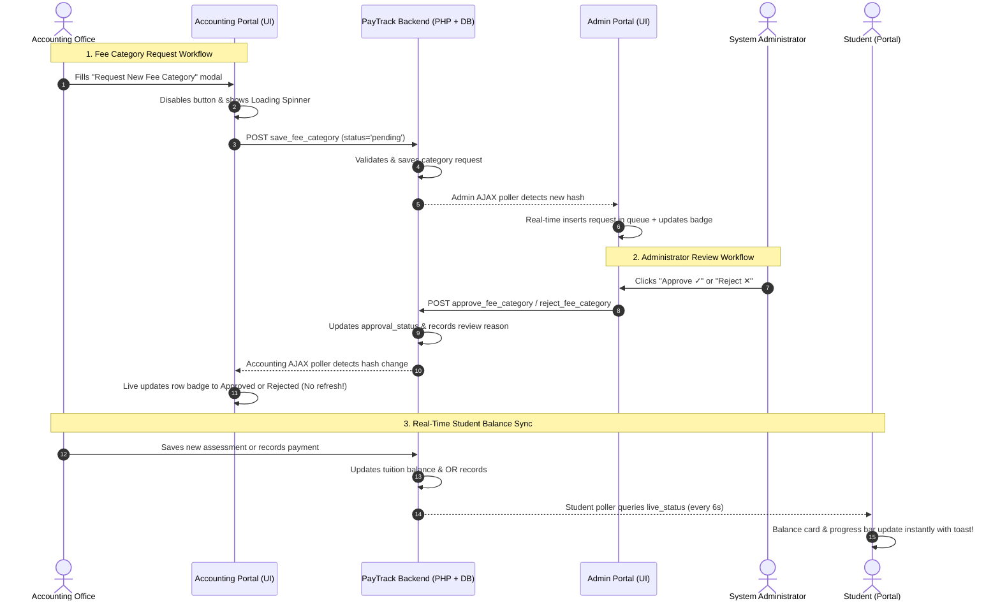

# 📘 PayTrack — System Architecture & Technical Documentation

> **PayTrack** is a centralized, real-time Student Tuition & Financial Management System designed for educational institutions. It features modern fintech-grade aesthetics, responsive multi-portal workflows (Student, Accounting, and Admin), real-time live balance synchronization, multi-tier approval governance, and automated transactional email notifications.

---

## 🛠️ 1. Tools, Libraries & Tech Stack

### A. Backend & Runtime Environment
| Technology | Version / Specification | Purpose / Role |
| :--- | :--- | :--- |
| **PHP** | `8.2+` (Native OOP + PDO) | Server-side execution, REST/JSON API endpoints, session handling, business logic |
| **MariaDB / MySQL** | `10.4.32-MariaDB` (InnoDB) | Relational database engine, foreign key constraints, ACID transaction compliance |
| **Apache HTTP Server** | `2.4.58` (XAMPP Suite) | Web server, request dispatching, URL rewriting (`mod_rewrite`), header security |
| **Composer** | `2.x` | PHP dependency manager (autoloader for external libraries such as PHPMailer) |

### B. Frontend Architecture & UI Frameworks
| Tool / Library | Version / Source | Purpose / Role |
| :--- | :--- | :--- |
| **HTML5 & CSS3** | Modern Standards | Semantic document structure, responsive layout, CSS variables, glassmorphic UI |
| **Bootstrap** | `5.3.3` (Local + CDN) | Grid system, utility classes, responsive typography, and mobile-friendly components |
| **jQuery** | `3.7.1` (Minified CDN) | Client-side AJAX polling engine (`$.ajax`), DOM traversal, event management |
| **SweetAlert2** | `11.x` (CDN) | Non-intrusive toast notifications, confirmation dialogs, interactive modals |
| **Custom Fintech CSS** | `main.css` & `portal-chrome.css` | Institutional dark green theme (`#0b3d2e`), print stylesheets, receipts, cards |

### C. Mail & Communication Stack
| Tool / Component | Specification | Purpose / Role |
| :--- | :--- | :--- |
| **PHPMailer** | `v6.9.1` (via Composer) | Robust SMTP mailer supporting HTML templates, inline CSS, TLS/SSL, attachments |
| **Google SMTP Relay** | `smtp.gmail.com:587` | Automated delivery of receipts, approval notices, credentials, and payment logs |
| **Email Audit Trail** | `email_logs` Database Table | Full logging of recipient, subject, event type, delivery status, and timestamps |

### D. Security & Data Integrity Features
- **Cross-Site Request Forgery (CSRF)**: Cryptographically secure tokens per session (`csrf_field()`, `verify_csrf()`).
- **Password Security**: `PASSWORD_BCRYPT` salted hashing with forced password update on first login.
- **Role-Based Access Control (RBAC)**: Strict role guards on every entrypoint (`admin`, `accounting`, `student`).
- **Subresource Integrity (SRI)**: SHA-384 integrity hashes on all CDN stylesheets and scripts.
- **SQL Injection Prevention**: 100% prepared PDO statements with parameterized input bindings.
- **Double-Submit / Spam Protection**: Instant submit button disabling + backend duplicate request locks.

---

## 🔑 2. System Credentials, API Keys & Configuration Parameters

All system configurations are centralized in [`config/config.php`](file:///c:/xampp/htdocs/PayTrack/config/config.php) and [`config/database.php`](file:///c:/xampp/htdocs/PayTrack/config/database.php):

### A. Environment & Dynamic URL
- **`APP_NAME`**: `'Paytrack'`
- **`APP_VERSION`**: `'1.0.0'`
- **`APP_URL`**: Auto-detected dynamically (e.g. `http://localhost/Paytrack`). Automatically adjusts whether run on localhost, IP address, or domain.

### B. Database Parameters (MariaDB/MySQL)
```php
define('DB_HOST',    'localhost');
define('DB_NAME',    'paytrack');
define('DB_USER',    'root');
define('DB_PASS',    '');          // Default XAMPP setup (no password)
define('DB_CHARSET', 'utf8mb4');
```

### C. Mail & SMTP Relay Configuration (Google Gmail)
```php
define('MAIL_HOST',   'smtp.gmail.com');
define('MAIL_PORT',   587);                        // TLS Encryption
define('MAIL_USER',   'ncstenrollment@gmail.com'); // System Sender Account
define('MAIL_PASS',   'vuil adnd hkjp cxxf');      // 16-character Google App Password
define('MAIL_FROM',   'ncstenrollment@gmail.com');
define('MAIL_NAME',   'PayTrack System');
```

### D. Default Seed User Accounts
| Role | Username | Password (Default) | Email | Description |
| :--- | :--- | :--- | :--- | :--- |
| **Admin** | `admin` | `Admin@1234` | `admin@paytrack.edu.ph` | Full system administrator, governance & user management |
| **Accounting** | `accounting` | `Accounting@1234` | `accounting@paytrack.edu.ph` | Cashier, fee assessor, payment recorder, receipt issuer |
| **Student** | `2024-81830` | `Student@1234` | `test.student.679@example.com` | Maria Santos — BSIT-41A2 with active assessment & history |
| **Student** | `2023-00000` | `Student@1234` | `student@paytrack.edu.ph` | Kurt De Mesa — sample student account |

---

## 📁 3. Per-Folder & Per-File Function Explanation

Below is the exhaustive architectural breakdown of every folder and critical file in the repository.

```
PayTrack/
├── assets/                  # Frontend static files (CSS, JS, Fonts, Images)
├── config/                  # Configuration files (Database, Mail, App constants)
├── controllers/             # Application controllers (Business logic & handlers)
├── core/                    # Core system libraries (Auth, Helpers, Mailer)
├── database/                # Schema, DDL migrations, and initial seed data
├── models/                  # Database models / Data Access Layer (PDO)
├── public/                  # Public web document root and HTTP entrypoints
│   ├── accounting/          # Accounting Portal entrypoint & routing
│   ├── admin/               # Administrator Portal entrypoint & routing
│   └── student/             # Student Portal entrypoint & live polling API
├── vendor/                  # Third-party dependencies managed by Composer
└── views/                   # Template views and presentation layer
    ├── accounting/          # Accounting UI dashboards and modal templates
    ├── admin/               # Admin UI dashboards and governance views
    ├── auth/                # Sign-in and password management views
    ├── layouts/             # Shared layout masters
    └── student/             # Student UI dashboard and assessment displays
```

---

### 📂 `config/` — System Configuration
- **[`config/config.php`](file:///c:/xampp/htdocs/PayTrack/config/config.php)**: Master configuration file. Defines `APP_NAME`, dynamic `APP_URL`, database credentials, and Google SMTP settings.
- **[`config/database.php`](file:///c:/xampp/htdocs/PayTrack/config/database.php)**: Singleton database connector (`Database::getInstance()`). Returns a persistent, optimized `PDO` instance configured with `ERRMODE_EXCEPTION` and `FETCH_ASSOC`.

---

### 📂 `core/` — Core Infrastructure & System Services
- **[`core/Auth.php`](file:///c:/xampp/htdocs/PayTrack/core/Auth.php)**: Handles user authentication, session security, role verification (`requireRole()`), CSRF token lifecycle, flash messaging (`setFlash()`, `getFlash()`), and user login tracking.
- **[`core/helpers.php`](file:///c:/xampp/htdocs/PayTrack/core/helpers.php)**: Global convenience functions:
  - `peso($amount)`: Formats numbers into Philippine Peso currency strings (`₱1,500.00`).
  - `e($string)`: XSS sanitization helper wrapper around `htmlspecialchars()`.
  - `csrf_field()` & `verify_csrf()`: Generates and validates CSRF tokens.
  - `redirect($url)`: Performs standard HTTP 302 redirects with buffer clearing.
- **[`core/Mailer.php`](file:///c:/xampp/htdocs/PayTrack/core/Mailer.php)**: Wrapper around PHPMailer. Automatically compiles responsive HTML email templates for:
  - Account credential notifications
  - Tuition assessment statements
  - Official Payment Receipts (OR) with itemized financial breakdowns
  - Fee category approval and rejection governance notices
  - Automatically writes an audit log record into `email_logs`.

---

### 📂 `controllers/` — Business Logic Controllers
- **[`controllers/AccountingController.php`](file:///c:/xampp/htdocs/PayTrack/controllers/AccountingController.php)**:
  - `assignTuitionFee()`: Computes customized fee breakdowns, updates academic level/school year, and creates or updates a student's `tuition_fees` assessment.
  - `recordManualPayment()`: Processes over-the-counter payments, generates official receipt numbers (`OR-YYYY-XXXXX`), records payment rows, updates remaining balances, and dispatches receipt emails.
  - `saveFeeCategory()`: Handles fee category creation requests with duplicate prevention and admin notification triggers.
  - `deleteFeeCategory()`: Removes or cancels categories if not tied to active assessments.
  - `realtimeFeed()`: High-performance JSON API endpoint returning live collection metrics, updated balances, and category hash status for the frontend poller.
- **[`controllers/AdminController.php`](file:///c:/xampp/htdocs/PayTrack/controllers/AdminController.php)**:
  - `createStudent()` / `createAccounting()`: Manages user creation, auto-generates credentials, and dispatches welcome emails.
  - `deleteUser()`: Safely purges user records and related student profiles.
  - `approveFeeCategory()`: Approves pending fee categories, sets status to `approved`, and alerts the requesting accounting staff.
  - `rejectFeeCategory()`: Rejects pending fee categories with required reason explanation, sets status to `rejected`, and sends feedback email to accounting.
- **[`controllers/AuthController.php`](file:///c:/xampp/htdocs/PayTrack/controllers/AuthController.php)**: Authenticates credentials against password hashes, enforces first-time password resets, routes users to their respective portal, and terminates sessions upon logout.
- **[`controllers/StudentController.php`](file:///c:/xampp/htdocs/PayTrack/controllers/StudentController.php)**: Provides student data accessors for assessments, payment history, and downloadable receipt generation.
- **[`controllers/FeeController.php`](file:///c:/xampp/htdocs/PayTrack/controllers/FeeController.php)**: Institutional fee category utilities and catalog lookups.
- **[`controllers/PaymentController.php`](file:///c:/xampp/htdocs/PayTrack/controllers/PaymentController.php)**: Payment verification and ledger helpers.

---

### 📂 `models/` — Data Access Layer (PDO Models)
- **[`models/User.php`](file:///c:/xampp/htdocs/PayTrack/models/User.php)**: Queries the `users` table for authentication, role assignments, passwords, online activity status, and profile metadata.
- **[`models/Student.php`](file:///c:/xampp/htdocs/PayTrack/models/Student.php)**: Manages `students` table records: student IDs, course, grade level, section, contact details, and parent/guardian emails.
- **[`models/FeeCategory.php`](file:///c:/xampp/htdocs/PayTrack/models/FeeCategory.php)**: Manages `fee_categories` with approval workflows:
  - `all()`: Fetches all categories including pending and rejected with requester details.
  - `allActive()`: Fetches only approved, active categories for tuition assignment.
  - `getPendingApprovals()`: Queries requests awaiting Administrator decision.
  - `requestCreate()`: Inserts a category in `pending` status.
  - `approve()` & `reject()`: Updates governance state with timestamps and review notes.
- **[`models/TuitionFee.php`](file:///c:/xampp/htdocs/PayTrack/models/TuitionFee.php)**: Manages assessments (`tuition_fees` and `tuition_fee_items` tables), computes balance due, tracks payment progress, and handles itemized fee splits.
- **[`models/Payment.php`](file:///c:/xampp/htdocs/PayTrack/models/Payment.php)**: Manages `payments` table records, tracks OR numbers, payment modes (Cash, Online, GCash, Bank Transfer), and receipts.
- **[`models/EmailLog.php`](file:///c:/xampp/htdocs/PayTrack/models/EmailLog.php)**: Accesses `email_logs` for tracking system communication, delivery states, and date/type filters.
- **[`models/AuditLog.php`](file:///c:/xampp/htdocs/PayTrack/models/AuditLog.php)**: Tracks critical system actions for security compliance.

---

### 📂 `public/` — Public Web Root & HTTP Entrypoints
- **[`public/index.php`](file:///c:/xampp/htdocs/PayTrack/public/index.php)**: Public landing page showcasing system features, contact information, mobile navigation drawer, and an integrated modal sign-in form.
- **[`public/accounting/index.php`](file:///c:/xampp/htdocs/PayTrack/public/accounting/index.php)**: Accounting portal gateway. Enforces `accounting` role session, routes POST actions, handles the `realtime_feed` action, loads live financial metrics, and renders the dashboard.
- **[`public/admin/index.php`](file:///c:/xampp/htdocs/PayTrack/public/admin/index.php)**: Administrator portal gateway. Enforces `admin` role session, provides `live_fee_approvals` JSON feed, handles user creation/deletion and fee category approvals, and renders governance views.
- **[`public/student/index.php`](file:///c:/xampp/htdocs/PayTrack/public/student/index.php)**: Student portal gateway. Enforces `student` role session, provides the `live_status` polling API endpoint for real-time tuition balance reflection, and renders student views.

---

### 📂 `views/` — View Templates & Presentation
- **[`views/accounting/dashboard.php`](file:///c:/xampp/htdocs/PayTrack/views/accounting/dashboard.php)**:
  - **KPI Metrics**: Real-time revenue, outstanding receivables, and collection percentages.
  - **Student Directory & Assessment Modal**: Custom fee breakdown assignments with configurable rates per student.
  - **Tuition Assessments Table**: View assessments with the **"View Receipt"** modal button (replaces delete).
  - **Official Statement / Assessment Receipt Modal**: Printable document with institutional header, student metadata, itemized breakdown, transaction history, and signature area.
  - **Fee Categories Governance**: Shows status badges (`⏳ Pending Admin Approval`, `✕ Rejected`, `✓ Approved & Active`), "Request to Admin" button, loading animations, reason modal, and AJAX real-time DOM synchronizer.
  - **Notification Dropdown**: Shows unread alerts for pending requests and admin approval/rejection outcomes.
- **[`views/admin/dashboard.php`](file:///c:/xampp/htdocs/PayTrack/views/admin/dashboard.php)**:
  - **System Overview**: Live user counters, online presence indicators, and activity logs.
  - **User Management**: Add, search, and delete students or accounting staff.
  - **Fee Approvals Section**: Live review queue for accounting requests with one-click Approve and modal-based Reject with reason.
  - **Email Audit Logs**: Filterable email table with live keyword search, event type dropdown, delivery status, and date presets.
  - **Real-Time Poller**: Uses AJAX to listen for new fee category requests from Accounting without manual page reload.
- **[`views/student/dashboard.php`](file:///c:/xampp/htdocs/PayTrack/views/student/dashboard.php)**:
  - **Tuition Overview Card**: Displays total assessed tuition, amount paid, and remaining balance.
  - **Progress Visualizer**: Color-coded balance progress bar with payment percentage.
  - **Itemized Breakdown**: Full itemization of matriculation, laboratory, LMS, and unit fees.
  - **Transaction History**: List of all verified payments with downloadable official receipts.
  - **Live Balance Poller**: Automatically queries `action=live_status` every 6 seconds and updates balance figures instantly when Accounting posts changes.
- **[`views/auth/login.php`](file:///c:/xampp/htdocs/PayTrack/views/auth/login.php)**: Standalone sign-in screen with password visibility toggle and validation.
- **[`views/auth/change_password.php`](file:///c:/xampp/htdocs/PayTrack/views/auth/change_password.php)**: First-time login forced password update screen.

---

### 📂 `database/` — Database DDL & Seed Scripts
- **[`database/schema.sql`](file:///c:/xampp/htdocs/PayTrack/database/schema.sql)**: Complete database schema defining `users`, `students`, `fee_categories` (with approval columns: `approval_status`, `requested_by`, `rejection_reason`, `requested_at`, `reviewed_at`), `tuition_fees`, `tuition_fee_items`, `payments`, and `email_logs`.
- **[`database/seed.sql`](file:///c:/xampp/htdocs/PayTrack/database/seed.sql)**: Seed records containing default administrator, cashier accounts, fee categories, and test student enrollments.

---

### 📂 `assets/` — Frontend Assets
- **`assets/bootstrap/`**:
  - `css/bootstrap.css`: Local Bootstrap 5.3 stylesheet fallback.
  - `js/bootstrap.min.js`: Local Bootstrap 5.3 JavaScript bundle fallback.
- **`assets/css/main.css`**: Core design styles, responsive navigation, custom typography, table styles, and modal compatibility rules overriding Bootstrap backdrop defaults.
- **`assets/css/portal-chrome.css`**: Sidebar navigation, topbar layouts, chip components, notification bell dropdowns, and button styles.

---

## ⚡ 4. Real-Time AJAX Flow Diagram



---

## 🚀 5. How to Run & Verify

1. **Start Services in XAMPP**:
   - Start **Apache** (Port `80`)
   - Start **MySQL / MariaDB** (Port `3306`)
2. **Import Database** (if fresh setup):
   - Access `http://localhost/phpmyadmin/`
   - Import [`database/schema.sql`](file:///c:/xampp/htdocs/PayTrack/database/schema.sql) followed by [`database/seed.sql`](file:///c:/xampp/htdocs/PayTrack/database/seed.sql).
3. **Open Portals in Browser**:
   - **Landing Page**: `http://localhost/Paytrack/public/`
   - **Admin Portal**: `http://localhost/Paytrack/public/admin/`
   - **Accounting Portal**: `http://localhost/Paytrack/public/accounting/`
   - **Student Portal**: `http://localhost/Paytrack/public/student/`
